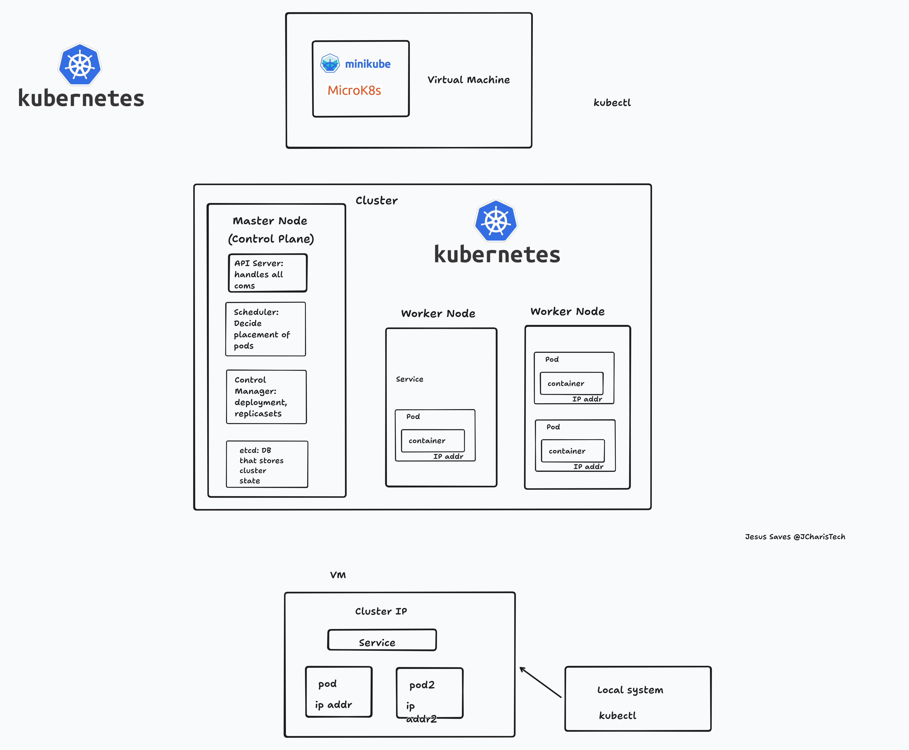

# devops_project
A collection of DevOps Project


### Kubernetes Overview


#### Commands for Kubernetes End to End Tutorial
```bash
# list running cluster
multipass list
multipass ls

# create and launch an linux vm instance
multipass launch -n microk8s-vm -c 2 -m 2GB -d 20GB

# connect to the VM directly
multipass shell microk8s-vm
# The iptables command is necessary to permit traffic between the VM and host.
sudo iptables -P FORWARD ACCEPT

# inside ubuntu@microk8s-vm add to usergroup
sudo usermod -a -G microk8s ubuntu
sudo chown -R ubuntu ~/.kube

# Create a pod 
microk8s kubectl run pod01 --image nginx
# View running pod with their IP
microk8s kubectl get pod -o wide
# access the running nginx via the IP of the pod from within the vm
curl http://10.1.254.71

# To view it outside you need a service (router??)
microk8s kubectl expose pod pod01 --name nginx-svc --type NodePort --port  80
microk8s kubectl  get svc

# Get IP of vm([172](http://172.17.85.224:30712/))
ip a
ip addr 

# How to run kubectl from host to interect with microk8s vm cluster
# 1 copy raw config and go to your host outside your vm and paste it in  mykube_config.yaml
# 2 change the IP from 127.0.0.1 to the IP of the microk8s linux ubuntu IP
microk8s kubectl config view --raw 
kubectl get po --kubeconfig .\mykube_config.yaml

microk8s dashboard-proxy
# https://127.0.0.1:10443 -> replace with vm IP http://172.17.85.224:10443
# When you see this `Client sent an HTTP request to an HTTPS server.` that means it works so you need to place https://172.17.85.224:10443
# paste in the toke to login

# Build Image
podman build -t hospitals-api .

# login to podman to push image
podman login docker.io
Username: myrhusername
Password: ***********

# push image to docker hub
podman build -t myimage .
podman push myimage docker://jcharistech/myimage

podman push hospitals-api docker://jcharistech/hospitals-api
# To pull from localimage add imagePullPolicy: Never under images

# Apply Deployment
 kubectl apply -f deploy\deployment.yaml  --kubeconfig .\..\my_kube_config.yaml

# Get info
kubectl get pods --kubeconfig .\..\my_kube_config.yaml -o wide

kubectl create deployment backend-api --image hospitals-api:latest --replicas 1 --ports 8000 --dry-run=client -o yaml --kubeconfig .\..\my_kube_config.yaml


# To access the app locally(http://localhost:8000/) you will need to port-forward it (service had 8000, 8000)
kubectl port-forward backend-api-deployment-56f5878d8f-lns2q 8000:8000 --kubeconfig .\..\my_kube_config.yaml


# Delete a deployment ,ignore the hash id
 kubectl delete deployment backend-api-deployment --kubeconfig .\..\my_kube_config.yaml

# List a service
 kubectl get svc --kubeconfig .\..\my_kube_config.yaml -o wide

# delete a service
kubectl delete svc backend-api --kubeconfig .\..\my_kube_config.yaml
```